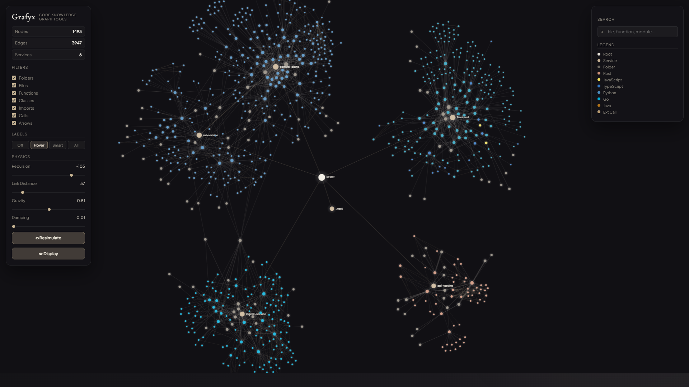
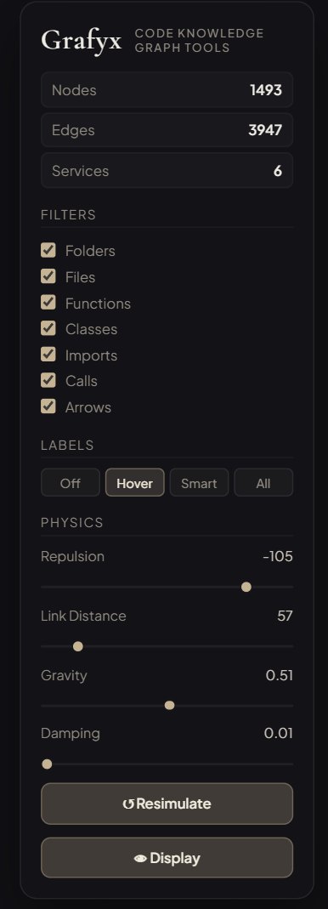

# `Grafyx` - Code Knowledge Graph & Documentation Tool

<div align="center">

```text
=============================================================
    ██████╗ ██████╗  █████╗ ███████╗██╗   ██╗██╗  ██╗
   ██╔════╝ ██╔══██╗██╔══██╗██╔════╝╚██╗ ██╔╝╚██╗██╔╝
   ██║  ███╗██████╔╝███████║█████╗   ╚████╔╝  ╚███╔╝ 
   ██║   ██║██╔══██╗██╔══██║██╔══╝    ╚██╔╝   ██╔██╗ 
   ╚██████╔╝██║  ██║██║  ██║██║        ██║   ██╔╝ ██╗
    ╚═════╝ ╚═╝  ╚═╝╚═╝  ╚═╝╚═╝        ╚═╝   ╚═╝  ╚═╝
=============================================================

Visualize Your Codebase Like Never Before
```

<br>_*This project May have bug for now it is in Beta Phase*_

</div>

[](https://github.com/0xarchit/grafyx)
[](LICENSE)  
[](https://rust-lang.org)
[](https://d3js.org)

---

## ✦ Table of Contents
1. [Overview](#-overview)
2. [Visual Demo](#-visual-demo)
3. [Architecture](#-architecture)
4. [Features](#-features)
5. [Live Physics Engine](#-live-physics-engine)
6. [Installation](#-installation)
7. [Usage](#-usage)
8. [Configuration](#-configuration)
9. [Attribution](#-attribution)

---

## ✦ Overview

**Grafyx** is a high-performance, CLI-driven code knowledge graph tool designed to map and visualize the complex relationships within modern codebases. By parsing directory structures and service interactions, Grafyx generates an interactive 2D/3D force-directed graph that helps developers understand dependency chains, structural bottlenecks, and project architecture at a glance.

Developed with **Rust** for safety and speed, and **D3.js** for fluid frontend interactions, Grafyx bridges the gap between static analysis and intuitive visual exploration.

---

## ⬢ Visual Demo



---

## ❖ Architecture

Grafyx follows a decoupled architecture, ensuring high-speed processing and a responsive user experience.

```text
┌─────────────────────────────────────────────────────────────────────────┐
│                             GRAFYX PLATFORM                             │
├─────────────────────────────────────────────────────────────────────────┤
│                                                                         │
│  ┌──────────────┐    ┌─────────────────┐    ┌──────────────┐            │
│  │   Rust CLI   │    │  Graph Engine   │    │   Storage    │            │
│  │   (Parser)   │◄──►│  (Node/Edge IR) │◄──►│ (SQLite/JSON)│            │
│  └──────────────┘    └────────┬────────┘    └──────────────┘            │
│                               │                                         │
│                               ▼                                         │
│                      ┌─────────────────┐                                │
│                      │  D3.js Frontend │                                │
│                      │  (Interactive)  │                                │
│                      └─────────────────┘                                │
│                                                                         │
└─────────────────────────────────────────────────────────────────────────┘
```

---

## ✥ Features

| Feature | Description | Status |
|---------|-------------|--------|
| **Recursive Scanning** | Scans entire projects to map file/directory hierarchies. | ✔ Active |
| **Hot Physics** | Real-time adjustable simulation forces with sub-millisecond response. | ✔ Active |
| **Interactive UI** | Drag nodes, toggle arrows, and click to inspect connections. | ✔ Active |
| **Persistence** | Automatically saves layout and physics settings via `grafyx-settings`. | ✔ Active |
| **Search & Filter** | Locate specific modules or files within massive graphs. | ✔ Active |
| **Dual Storage** | Outputs both human-readable JSON and performance-optimized SQLite. | ✔ Active |

---

## ◈ Live Physics Engine

Grafyx features a "Hot Update" physics engine inspired by tools like Obsidian. Adjusting sliders instantly ripples through the graph without requiring a full re-render, keeping the simulation fluid and "liquid."

<div align="center">
  
</div>

### Force Parameters
- **Repulsion**: Determines how much nodes push away from each other.
- **Link Distance**: Controls the target length for edges.
- **Gravity (Center Force)**: Pulls all nodes toward the center point.
- **Damping**: Adjusts the decay rate of movement for stability.

---

## ⬢ Installation

### Prerequisites
- **Rust**: 1.94 or later
- **SQLite**: (Optional, for database inspection)

### Build from Source
```bash
# 1. Clone the repository
git clone https://github.com/0xarchit/grafyx.git
cd grafyx

# 2. Build for release
cargo build --release

# 3. Add to PATH (Optional)
# Copy target/release/grafyx.exe to your bin directory
```

---

## ⌗ Usage

Grafyx is controlled primarily through the command line.

### Basic Scan
Map your current project history and architecture:
```bash
grafyx scan ./src
```

### Options
| Command | Description |
|---------|-------------|
| `grafyx scan <path>` | Scans the directory and generates `grafyx.json`. |
| `grafyx --version` | Display current version. |
| `grafyx --help` | Show detailed command usage. |

---

## ⌬ Configuration

Settings are persisted in the browser's `localStorage` under `grafyx-settings`. This allows you to maintain your custom visual configuration across different scans of the same project.

- **Theme**: Fixed dark mode for maximum contrast.
- **Node Colors**: Scaled based on connectivity or type (Service/Import vs. Structural).
- **Link Colors**: 
  - **Vibrant Green**: Service dependencies/imports.
  - **White**: Structural hierarchy.

---

## § License

Grafyx is licensed under the **Apache License 2.0**.  
See the [LICENSE](LICENSE) file for the full text and attribution requirements.

---

## ℡ Attribution

Grafyx is originally created and maintained by **0xArchit**.

If you build on top of this project, please provide proper attribution. Any derivative works must retain the original copyright notice in the license.

---

<div align="center">
Grafyx - Code Knowledge Graph Tool &copy; 2026 0xArchit
</div>